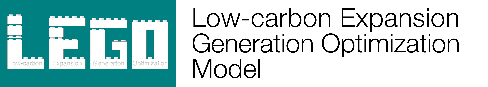
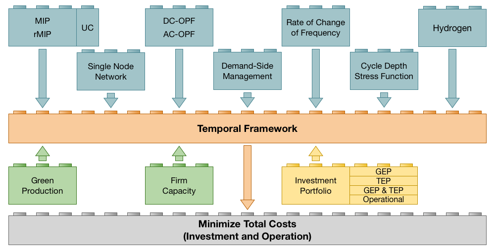
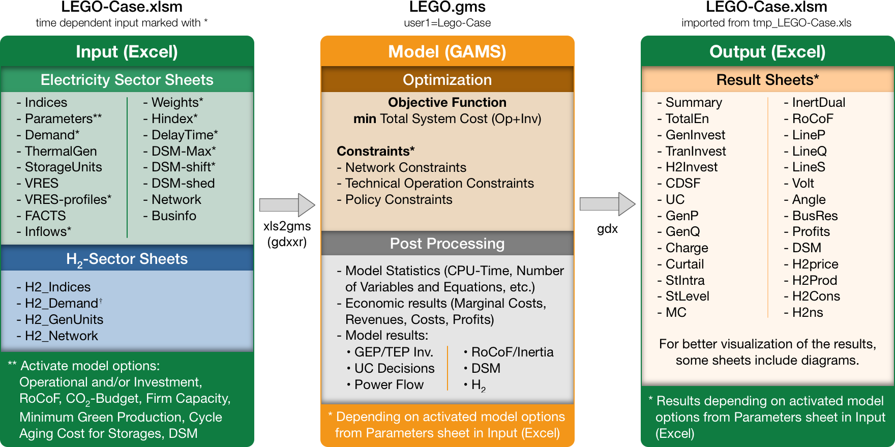
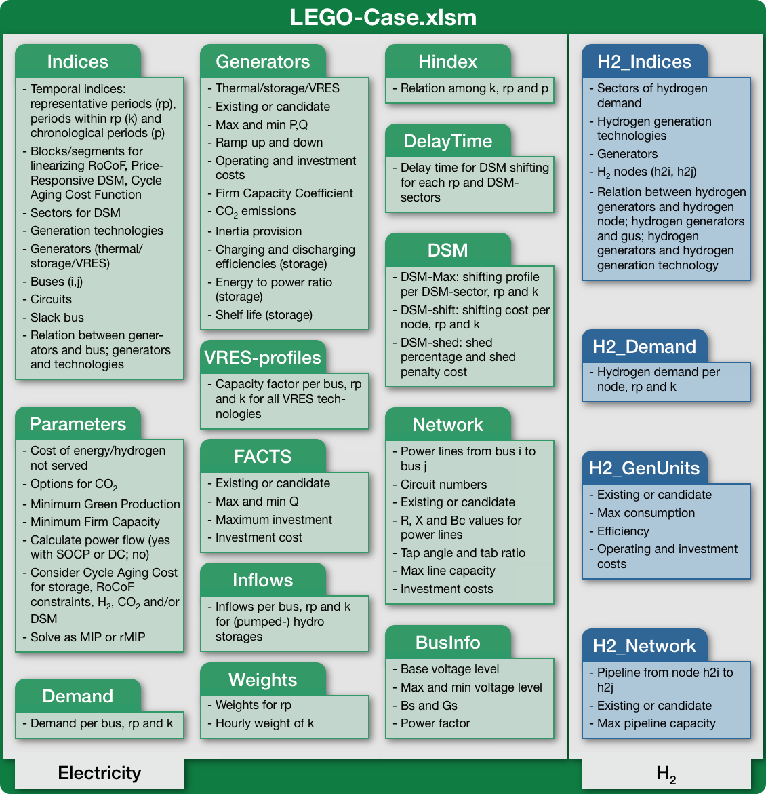

# Low-carbon Expansion Generation Optimization (LEGO) model

LEGO is a mixed integer quadratically constrained optimization problem and has been designed to be a multi-purpose tool, like a Swiss army knife, that can be employed to study many different aspects of the energy sector. Ranging from short-term unit commitment to long-term generation and transmission expansion planning. The underlying modeling philosophies are: modularity and flexibility. LEGO is also composed of thematic modules that can be added or removed from the model easily via data options depending on the scope of the study. You can use this code freely according to the LICENSE file (https://opensource.org/licenses/MIT), but please cite our paper [1] if you do.

This version of Low-carbon Expansion Generation Optimization (LEGO) has been extended and includes:
* Freely available and code (and data examples) shared on Github. And there are some novelties.
* Flexibility:  1) operation only / TEP / GEP / GEPTEP ; 2) rMIP / MIP / MIQCP; 3) chronological hours / representative periods / load blocks
* Modularity:   1) considering/relaxing unit commitment decisions; 2) single-node / DC-OPF / AC-OPF (SOCP); 3) consider battery degradation via cycle aging costs; 4) rate of change of frequency system inertia constraints; 5) demand-side management (via load shedding and load shifting); 6) hydrogen sector
* Unique and versatile combinations of modules.

Its unique temporal structure allows LEGO to function with either chronological hourly data, or all kinds of representative periods. LEGO allows for modeling short- and long-term storage technologies with representative periods, e.g., long-term operation of large hydro reservoirs can be represented without having to renounce computational advantages of representative periods. Temporal flexibility and modularity of the model is something quite unique (that enables a plethora of many different studies) with one single model.

# Software Architecture
The LEGO code runs entirely in GAMS (using MIQCP solvers such as CPLEX or Gurobi). Data and results are read from / exported to Excel via gdx as indicated in the figure below:

# Input Data
LEGO input data is organized by sector: electricity (green) and hydrogen (blue). A more detailed description of LEGO's input data organized in Excel Sheets can be found below:

# Case Studies
* **LEGO-Base-Case-Study-7LRP**: Base case study for the model with stylized power system and 7 representative days.
* **LEGO-Base-Case-Study-Hourly**: Base case study for the model with stylized power system and chronological hourly representation of time horizon of one year.
* **EnStOpInvMo-7LRP-kmeans-net.xlsm**: Case study used in paper [[1]](https://doi.org/10.1016/j.apenergy.2020.115925) [This data file belongs to a preliminary version of the code and is no longer compatible with the current LEGO.gms file].

# How to install LEGO?
1) If you haven't done so, download GAMS to your computer from https://www.gams.com/download/
2)	Follow this link: https://github.com/wogrin/LEGO
3)	Download the ZIP file using the 'Code' button
4)	Unzip and keep all files in the same folder
  
# How to run LEGO?
1)	Double click on LEGO.gms
2) Unzip the data files (e.g. LEGO-Base-Case-Study-7LRP.zip) into .xlsm 
3) In GAMS, load your data file by writing 'user1=LEGO-Base-Case-Study-7LRP' in the GAMS parameters box in the upper right hand corner of the IDE or GAMS Studio screen (without the file extension)
4) Run the model with F9, or by clicking on the run button
5) Model outputs are automatically written into temporary Excel files (e.g. tmp_LEGO-Base-Case-Study-7LRP.xlsx), which can be imported into the data file (e.g. LEGO-Base-Case-Study-7LRP.xlsm) by clicking the 'Load' button on the Menu sheet

Notes:
* Since the LEGO code runs entirely in GAMS (using MIQCP solver CPLEX), a GAMS and CPLEX license is required if you want to run large-scale instances of the models.
* Avoid using spaces or special characters in your file names. 

# References
[1] [S. Wogrin, D. Tejada-Arango, S. Delikaraoglou, A. Botterud, Assessing the impact of inertia and reactive power constraints in generation expansion planning, Applied Energy,
Volume 280, 2020, 115925, ISSN 0306-2619.](https://doi.org/10.1016/j.apenergy.2020.115925)
